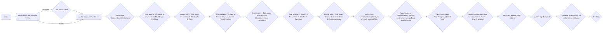

```mermaid
graph LR
    A[Iniciar] --> B(Verificar se a branch 'teste' existe)
    B -- Não existe --> C{Criar branch 'teste'}
    C --> D[Mudar para a branch 'teste']
    B -- Existe --> D
    D --> E{Criar pasta 'ferramentas_interativas_ia'}
    E --> F{Criar arquivo HTML para a ferramenta de Modelagem Preditiva}
    F --> G{Criar arquivo HTML para a ferramenta de Otimização de Rotas}
    G --> H{Criar arquivo HTML para a ferramenta de Análise de Risco Climático}
    H --> I{Criar arquivo HTML para a ferramenta de Monitoramento de Emissões}
    I --> J{Criar arquivo HTML para a ferramenta de Gestão de Resíduos}
    J --> K{Criar arquivo HTML para a ferramenta de Relatórios de Sustentabilidade}
    K --> L{Implementar funcionalidades interativas em cada página HTML}
    L --> M{Testar todas as funcionalidades e layout em diversos navegadores e dispositivos}
    M --> N{Fazer commit das alterações para a branch 'teste'}
    N --> O{Criar um pull request para mesclar a branch 'teste' na branch principal}
    O --> P{Revisar e aprovar o pull request}
    P --> Q{Mesclar o pull request}
    Q --> R{Implantar as alterações no ambiente de produção}
    R --> S{Finalizar}
```
